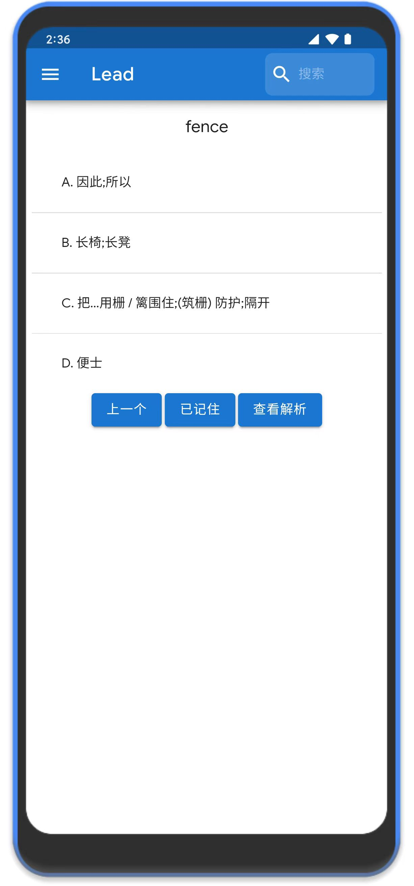
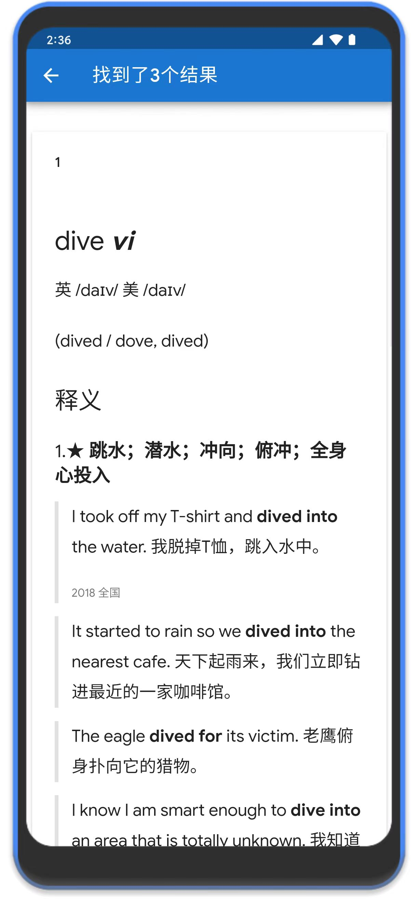
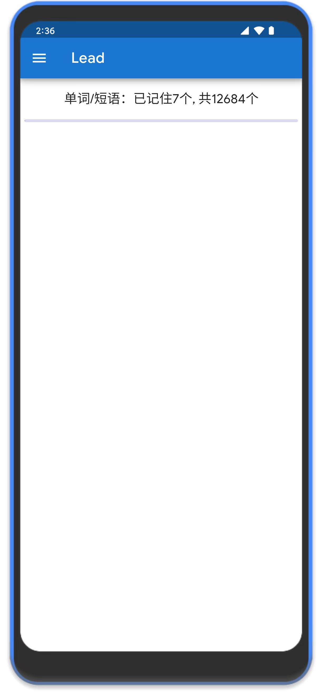
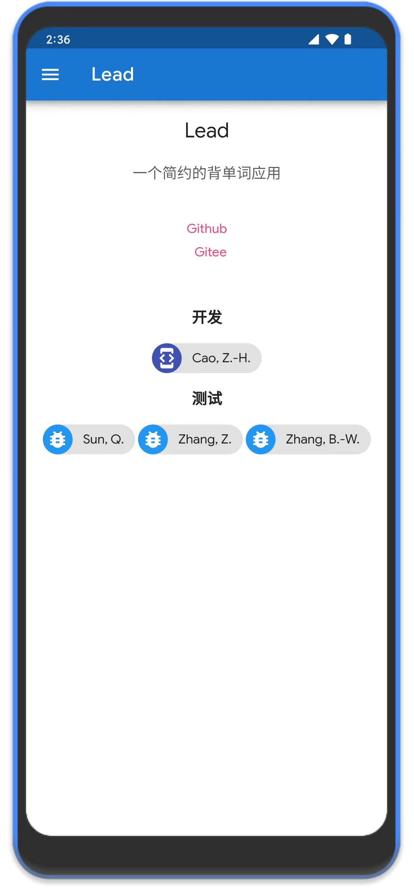

<h2 align="center">
Lead - Android
</h2>

<strong>一个简约的背单词应用</strong>

### 示例
|      |  |
|--------------------------------|--------------------------------|
|  |    |

### 相关项目
该项目来自[lead](https://github.com/caozhanhao/lead)